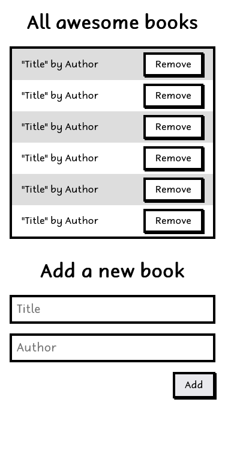

# Leaderboard

## 📗 Table of Contents

- [📖 Overview](#about-project)
  - [Project Objectives](#project-objectives)
  - [🛠 Built With](#built-with)
    - [Tech Stack](#tech-stack)
    - [Key Features](#key-features)
  - [🚀 Live Demo](#live-demo)
- [💻 Getting Started](#getting-started)
  - [Setup](#setup)
  - [Prerequisites](#prerequisites)
  - [Install](#install)
  - [Run tests](#run-tests)
  - [Deployment](#deployment)
- [👥 Authors](#authors)
- [🔭 Future Features](#future-features)
- [🤝 Contributing](#contributing)
- [⭐️ Show your support](#support)
- [🙏 Acknowledgements](#acknowledgements)
- [📝 License](#license)

## 📖 Overview 
In this project, we built a basic website that allows users to add/remove books from a list. This was achieved by using JavaScript objects and arrays, while using javascript DOM and basic events to dynamically modify the page.

### Project Objectives 
 [x] Create a new directory and initialize it with git.
- [x] Use npm init -y command to create package.json file.
- [x] Create the entry point for your JavaScript code called index.js
- [x] Create index.css file for your styles.
- [x] Create the main index.html file. Link your index.js and index.css files there.
- [x] Create a directory called modules.
- [x] Re-create your Awesome books app following the rules:
- [x] Use ES6 syntax.
- [x] Keep all funcionalities of the app without errors.
- [x] Refactor your methods and functions to arrow functions.
- [x] Use let and const in a correct way.
- [x] Display the current date below the navigation bar.
- [x] For this requirement you should use a library Luxon
- [x] Download the script and save it to your project.
- [x] Import it as a module.

<h3 align="center">Wireframe Provided</h3>

  

## 🛠 Built With 

### Tech Stack 

- [HTML](https://developer.mozilla.org/en-US/docs/Web/HTML)
- [JavaScript/ES6](https://262.ecma-international.org/6.0/)
- [webpack 5](https://webpack.js.org/)
- [npm](https://www.npmjs.com/)
- [Git](https://git-scm.com/)
- [GitHub](https://github.com)
- [Stylelinter](https://stylelint.io/)
- [ESLint](https://eslint.org/)
- [Webhint](https://webhint.io/)
- [Lighthouse](https://ethcar.github.io/lighthouse/)
- [SASS](https://sass-lang.com/)

### Key Features 

- [x] Use ES6 modules, with import and export.

## 🚀 Live Demo 

> [Live Demo Link](https://EngruugbeJimmy.github.io/leaderboard/)

  

## 💻 Getting Started 

- [Optional] Install git bash to your machine to enable you to clone this repo.
- install Visual Studio to be able to host a local live version.
- Install a browser to view the local live version.

To get a local copy up and running follow these simple example steps.
### Setup 

- Open the GitHub account using the repository's [link](https://github.com/EngruugbeJimmy/Awesome_Book_App2.git)

### Prerequisites 

- Internet connection
- A github account
### Install 

- copy the repo's link and clone it by writing `git clone https://github.com/EngruugbeJimmy/Awesome_Book_App2.git` on your git bash terminal.
- `npm install` to install the dependencies

### Run tests 

- You can check for errors by running linter tests found in the github flows.

### Deployment 

- run `npm run start` to run it locally.

## Authors 

👤 **EngruugbeJimmy**

- [GitHub](https://github.com/EngruugbeJimmy)
- [Twitter](https://twitter.com/abbaJdev)
- [LinkedIn](https://www.linkedin.com/in/abah-james-ugbede-356982159/)

<!-- FUTURE FEATURES -->

## 🔭 Future Features 

>  features I will add to the project.

- [ ] **[Awesome_book_basic]**
- [ ] **[Awesome_book_diamond]**
- [ ] **[Awesome_book_gold]**

(<a href="#readme-top">back to top</a>)

## 🤝 Contributing 

Contributions, issues, and feature requests are welcome!

Feel free to check the [issues page](../../issues/).

## ⭐️ Show your suppor 

Give a ⭐️ if you like this project!

## 📝 License 
This project is [MIT](./LICENSE) licensed.
